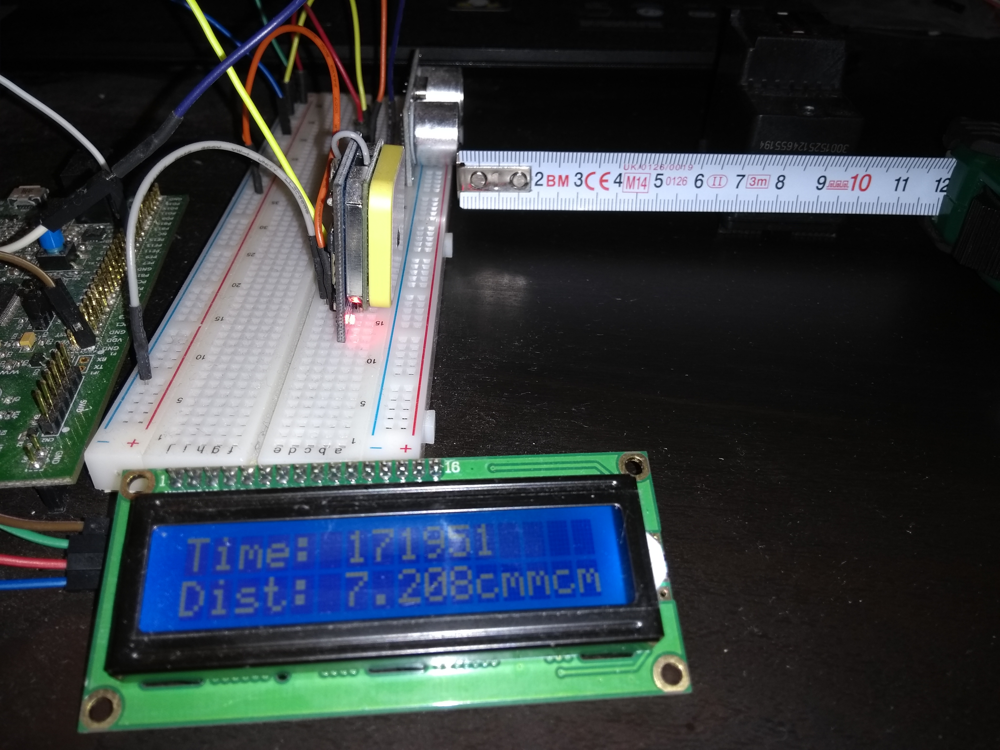

# Distance_and_TimeDisplay_FreeRTOS_STM32F411"
This is a project where multitaksing is demonstrated with FreeRTOS and STM32F411 Evalboard

## Summary
In this project, Time in HHMMSS format is displayed on LCD Display and the Distance of an object from an Ultrasonic sensor HC-SR04 is displayed in cm.
LCD Display is controlled via I2C bus. In this project i have used GPS module to extract time. Ultrasound module HC-04 to measure distance in cm between the module and the object. Time and Distance are displayed on the LCD display. The uC sends commands to LCD via I2C bus. I have used FreeRTOS to manage my 4 Tasks. Task1 is a dummy task that blinks LEDs. Task 2 parses time from a buffer that is filled when a DMA Transfer complete is done. Task 3 calculates the distance depending on the pulsewidth of the echo signal recieved from HC-04 module. Task 4 is for displaying the parsed time and distance to the LCD.

## HW used
* STM32F411VE Discovery board
* Ultrasonic sensor HC-SR04 Sensor module
* 1604 LCD Display via I2C Bus
* Waveshare Wireless UART GPS Module NEO-7M-C 

## SW Toolchain
* SW4STM32 built by Ac6 based on Eclipse IDE,
	* ARM-GCC Compiler
	* ST-Link Support
* Operating System- Ubuntu Linux	
		
## Working principle - Distance
The HC-04 module has Trigger and Echo pin. 
Timer 2 (TIM2-CH3) is configured to send the trigger signal with a specific dutycycle. 
Depending on the distance a pulse is generated by echo Pin.The Echo pin is connected to input capture Pin (Timer1-CH1).
The Pulsewidth of the received pulse is used to determine the distance.

For more details refer this site https://www.mouser.com/ds/2/813/HCSR04-1022824.pdf

